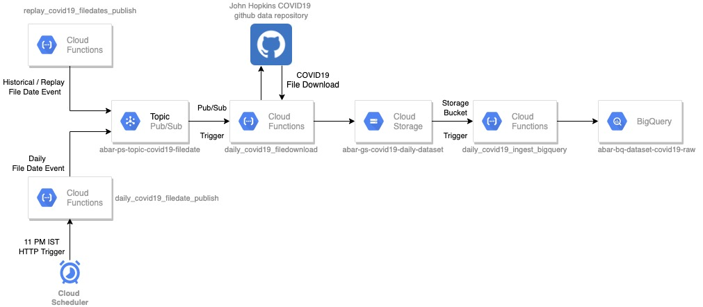

# gcp-covid19-cloudfunctions
Repository for COVID19 data engineering using Cloud Functions in Google Cloud Platform(GCP)

**Datapipeline Architecture:**    
   

1. **replay_covid19_filedates_publish** - There is no trigger associated with this function. This function is used for one-time historical load or replay of file downloads for a range of dates. The start and end dates are set as environment variables. COVID19 filedate events for the given dates are published at the target pub/sub topic.

2. **daily_covid19_filedate_publish** - The trigger is HTTP from the cloud scheduler. It runs every night at 11 pm IST. A COVID19 filedate event is published at the target pub/sub topic.   

3. **daily_covid19_filedownload** - The trigger is Pub/Sub topic. This function reads the COVID19 filedate event from Pub/Sub topic, parses the file date from the message and then downloads the CSV file from John Hopkins "CSSEGISandData/COVID-19" GitHub repository. The downloaded file is then saved onto the Cloud Storage Bucket.

4. **daily_covid19_ingest_bigquery** - The trigger is cloud storage bucket. Whenever a file gets updated or created in the COVID19 file download cloud storage bucket, this function will get triggered and the data will be loaded into the ingest raw data table in BigQuery.  

**Deployment from local machine:**  
Set the global environment variables in the file env.prod.yaml  

Set the cloud function specific configuration in /scripts/config.yaml  

To deploy the cloud functions from the local machine, navigate to /scripts/ folder and run the following from command line  
`python ./deploy.py`